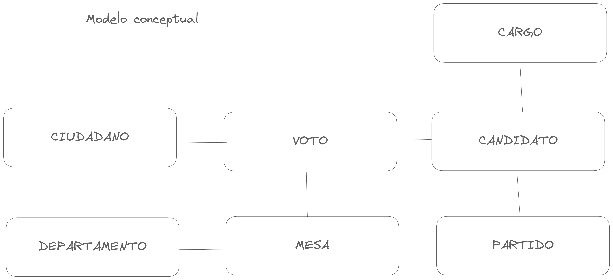
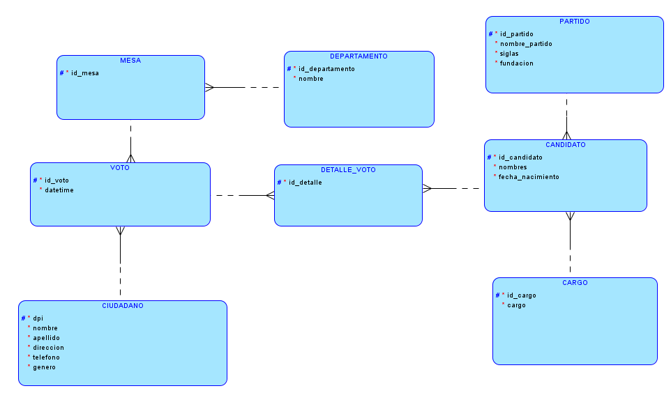
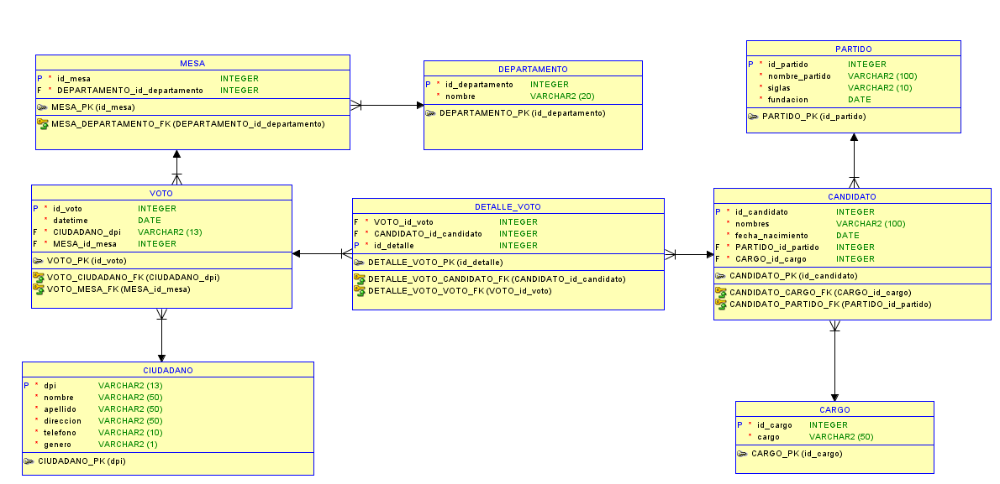

# MANUAL TÉCNICO

## INTRODUCCIÓN
Para el desarrollo de esta API REST, se utilizo el framework NestJS, el cual esta basado en NodeJS y Typescript. Para la base de datos se utilizo MySQL.

## Modelo conceptual

## Modelo lógico

## Modelo físico

### Explicación del modelo físico

Un modelo físico describe cómo se almacenan los datos en una base de datos relacional, incluyendo la estructura de las tablas, los tipos de datos, las relaciones entre las tablas y las restricciones de integridad. A continuación, se proporciona una explicación del modelo físico basado en el script de creación de tablas MySQL que has proporcionado:

1. **CIUDADANO**:
   - Esta tabla almacena información sobre los ciudadanos. Cada fila representa un ciudadano y se identifica de manera única por su número de Documento de Identidad (DPI).
   - Los campos incluyen DPI (clave primaria), nombre, apellido, dirección, número de teléfono, edad y género.

2. **CARGO**:
   - La tabla CARGO almacena información sobre los cargos políticos o posiciones que pueden ser ocupados en una elección.
   - Cada cargo se identifica por un identificador único (id_cargo) y tiene un nombre descriptivo.

3. **PARTIDO**:
   - Aquí se almacena información sobre los partidos políticos. Cada partido tiene un identificador único (id_partido) y se guarda su nombre completo, siglas y fecha de fundación.

4. **DEPARTAMENTO**:
   - Esta tabla representa los departamentos geográficos en los que se dividen las elecciones o el territorio. Cada departamento tiene un identificador único (id_departamento) y un nombre.

5. **MESA**:
   - Las mesas de votación se registran en esta tabla. Cada mesa tiene un identificador único (id_mesa) y está asociada a un departamento específico (referenciado por id_departamento).

6. **VOTO**:
   - Cada voto emitido en una elección se registra en esta tabla. Cada voto tiene un identificador único (id_voto), una fecha y hora de emisión, una referencia al ciudadano que emitió el voto (dpi), y la mesa en la que se emitió el voto (referenciada por id_mesa).

7. **CANDIDATO**:
   - Aquí se almacena información sobre los candidatos que participan en las elecciones. Cada candidato tiene un identificador único (id_candidato), nombres, fecha de nacimiento, y está asociado a un partido y a un cargo específico (referenciados por id_partido e id_cargo, respectivamente).

8. **DETALLE_VOTO**:
   - Esta tabla se utiliza para mantener un registro detallado de los votos emitidos. Cada detalle de voto tiene un identificador único (id_detalle) y está relacionado con un voto específico (referenciado por id_voto) y el candidato por el que se emitió el voto (referenciado por id_candidato).

